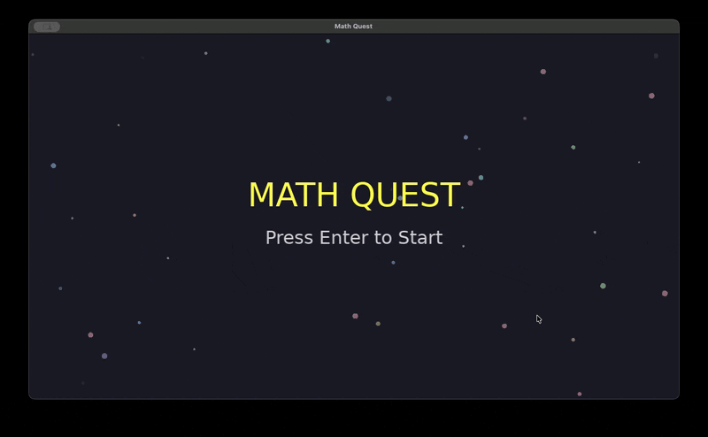

# Ossature Examples

This repo contains example projects created and built entirely with [Ossature](https://ossature.dev).

All specification documents for the examples provided in this repo are licensed under [CC0](https://creativecommons.org/public-domain/cc0/). All generated code for these examples is licensed under MIT.

## Currently Available Examples

- [Spenny](#spenny): CLI expense tracker, written in Python
- [Math Quest](#math-quest): Children's arithmetic game, built with LÖVE2D (Lua)
- [Qoizig](#qoizig): QOI image format encoder/decoder, written in Zig

## What to Look For

Each example includes a `specs/` directory with the specification documents used as input, an `output/` directory with the fully generated code, and an `.ossature/` directory that captures every intermediate artifact Ossature produced along the way.

Exploring the `.ossature/` directory is the best way to understand what Ossature does at each stage:

| Path | What It Is | Why It's Useful |
|------|-----------|-----------------|
| `audit-report.md` | A report generated by `ossature audit` that analyzes the specs for completeness, ambiguity, and feasibility. | See how Ossature reasons about a specification before any code is written. |
| `plan.toml` | The task plan generated after auditing. Breaks the project into ordered, dependency-aware build tasks. | Understand how Ossature decomposes a project into incremental steps. |
| `context/project-brief.md` | A distilled summary of the entire project, extracted from the specs. | See how Ossature condenses specifications into focused context for code generation. |
| `context/spec-briefs/*.md` | Per-spec summaries, one for each input specification file. | See how individual specs are summarized and later assembled into task prompts. |
| `context/interfaces/*.md` | Interface definitions extracted from the specs (APIs, data models, contracts). | Understand what structural boundaries Ossature identifies before generating code. |
| `tasks/**/prompt.md` | The full prompt sent to the LLM for a specific build task. | See exactly what the model receives — the assembled context, instructions, and constraints. |
| `tasks/**/response.md` | The raw LLM response for that task. | Compare what the model produced against the final output to understand post-processing. |
| `tasks/**/output.toml` | A summary of the generation and verification result for that task. | Check whether a task passed verification on the first try or required fixes. |
| `tasks/**/fix-*-prompt.md` | The prompt sent for fix iteration N, when verification failed after the initial build. | See how Ossature diagnoses and attempts to fix issues automatically. |
| `tasks/**/fix-*-response.md` | The LLM response for that fix iteration. | Trace the back-and-forth of the fixer loop. |

## Rebuilding an Example

Each example is a standalone Ossature project. To rebuild one, `cd` into its directory first (e.g., `cd spenny/`).

Make sure you set the environment variables for whichever model providers are configured in the example's `ossature.toml`. For example:

```bash
export ANTHROPIC_API_KEY=your_anthropic_key
export MISTRAL_API_KEY=your_mistral_key
```

To rebuild using the existing plan:

```bash
rm -rf output
ossature build
```

To re-audit and replan from scratch:

```bash
rm -rf output
ossature clean
ossature audit
# after auditing and planning finishes:
ossature build
```

---

## Spenny

Spenny is a command-line expense tracker written in Python. It's designed to be simple, fast, and dependency-free, using only Python's standard library with data stored in a human-readable JSON file (`expenses.json`). It supports adding, listing, deleting, and summarizing expenses, with filtering by category and date range. Each expense includes an amount, category, optional description, auto-generated ID, and a timestamp. It uses `argparse` for CLI parsing with subcommands and adheres to strict error handling with clear messages and appropriate exit codes.

The project is configured to use `anthropic:claude-opus-4-6` for audit, `anthropic:claude-sonnet-4-6` for planning and fixer loops, and `mistral:devstral-latest` for code generation and all other tasks.

The project is fully validated, audited, and built. See [What to Look For](#what-to-look-for) to explore the `.ossature/` directory, and check `output/` for the generated code.

To test run the built code:

```bash
cd spenny/output
uv run spenny --help
```

```
usage: spenny [-h] {add,list,delete,summary} ...

Spenny: A simple command-line expense tracker

positional arguments:
  {add,list,delete,summary}
    add                 Add a new expense
    list                List expenses
    delete              Delete an expense
    summary             Show spending summary

options:
  -h, --help            show this help message and exit
```

## Math Quest

Math Quest is a children's arithmetic game built with LÖVE2D (Lua) that presents progressively difficult math problems and accepts typed numeric answers. The game starts the player with a fixed number of lives and generates arithmetic problems that increase in difficulty as the player's score rises. Players type their answers using the keyboard, receiving immediate feedback through sound effects loaded from provided audio assets.

The project is configured to use `anthropic:claude-opus-4-6` for everything.

Two audio assets downloaded from [OpenGameArt](https://opengameart.org/) (licensed under CC0) are provided as context:
- `context/correct.wav`: Correct answer sound — Source: [Point Bell](https://opengameart.org/content/point-bell)
- `context/wrong.ogg`: Wrong answer sound — Source: [Error](https://opengameart.org/content/error)

The project is fully validated, audited, and built. See [What to Look For](#what-to-look-for) to explore the `.ossature/` directory, and check `output/` for the generated code.

To test run the built game (make sure you've downloaded [LÖVE2D](https://love2d.org/) first):

```bash
cd math_quest/output
love .
```



## Qoizig

Qoizig is a high-performance, zero-dependency command-line tool and library implemented in Zig for the [QOI (Quite OK Image)](https://qoiformat.org/) format. It provides encoding and decoding capabilities for QOI files — a fast, lossless image format. The tool converts between QOI and standard image formats (PPM P6 for RGB, PAM P7 for RGBA), strictly adhering to the QOI specification for byte-ordering, chunk compression, and pixel history states. The [QOI specification](https://qoiformat.org/qoi-specification.pdf) is provided as context in the `context/` directory.

The project is configured to use `anthropic:claude-opus-4-6` for all tasks.

The project is fully validated, audited, and built. See [What to Look For](#what-to-look-for) to explore the `.ossature/` directory, and check `output/` for the generated code.

To test run the built code (requires [Zig](https://ziglang.org/) 0.15.2+):

```bash
cd qoizig/output
zig build
./zig-out/bin/qoizig encode input.ppm output.qoi
./zig-out/bin/qoizig decode output.qoi decoded.pam
```
